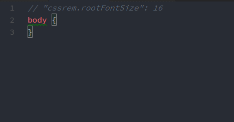

# cssrem

taro代码片段

<!--  -->

# 如何安装

```bash
暂无
```

# 如何使用

+ 暂无
+ 暂无

# 支持语言

html vue css less scss sass stylus tpl（php smarty3）

# 配置

点击 VS Code 的 `文件 > 首选项 > 设置`，打开设置面板：
+ 暂无
<!-- + `cssrem.rootFontSize` 基准font-size（单位：px），默认：16
+ `cssrem.fixedDigits` `px` 转 `rem` 小数点最大长度，默认：6
+ `cssrem.autoRemovePrefixZero` 自动移除0开头的前缀，默认：true -->

**注意：** 需要重新启动 VSCode 才会生效
